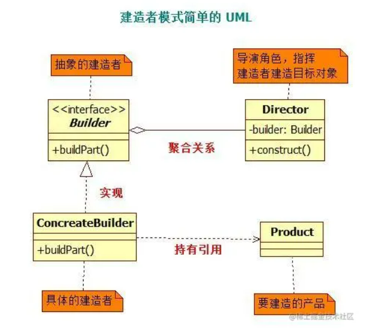

# 2022年度面试手册


## Java相关

### **`ArrayList`扩容机制**

- ArrayList底层基于数组实现, 默认情况初始大小为10, 
- 当数据大小超过10时,会自动进行扩容, 扩容为之前大小的1.5倍
- 调用Arrays.copyOf, 将之前的数据复制到扩容后的数组
- 然后将新加的数据添加到新的数组中


### HashMap底层实现原理

- 默认初始容量为16, 负载因子为0.75

- 数据结构为数组加链表

- 数据以键值对的方式进行存储

- 在添加数据时,根据key取hashcode再进行取模的方式,获取对应桶的下标, 将数据添加到对应桶中

- 每个桶是以链表的形式进行存储, 当产生hash冲突时, 根据key的对象的equal方法进行查找


### **悲观锁和乐观锁**

- 悲观锁: 总是假设最坏的情况,  认为每次操作都会对数据修改, 因此每次都会对数据进行上锁, 比如synchronized和ReentrantLock

- 乐观锁: 总是假设最好的情况, 每次访问数据都会认为他不会更新数据, 只有在真正更新数据的时候才会判断此期间有没有进行数据的更新.  java.util.concurrent.atomic包下的原子变量类就是使用了乐观锁的一种实现方式CAS实现的. (`AtomicInteger`)


### **线程池**

线程池是一种池化技术,  主要是利用资源复用的思想. 因为线程在创建过程中会涉及到CPU的上下文切换, 涉及内存的再分配.
**线程池参数:** 
    **核心线程数:** 默认的长期的工作线程
    **最大线程数:** 执行线程任务过程中动态创建的线程数
**常见的池化技术利用:** 线程池, 连接池, 内存池, 对象池

### **死锁**

**定义:** 多个线程是相互竞争的关系, 互持资源, 相互等待, 这样就会导致线程的永久等待, 就会导致死锁

**诱发死锁的因素:** 
    互斥条件
    占有且等待
    不可抢占
    循环等待

### AIO, NIO, BIO


### 设计模式: 

#### 六大设计原则:

- **总原则——开闭原则（Open Closed Principle）**

  > 一个软件实体,如类, 模块和函数应对扩展开放, 对修改关闭( 使用抽象类，接口等 )
  >
- **单一职责原则（Single Responsibility Principle）**
  
  > 一个类只有一个发生改变的原因
  >
  > 不要存在多于一个导致类变更的原因，也就是说每个类应该实现单一的职责，否则就应该把类拆分。
  
- **里氏替换原则（Liskov Substitution Principle）**
  
  > 所有引用基类的地方必须能透明地使用其子类的对象。
- **依赖倒置原则（Dependence Inversion Principle）**
  
  > 上层模块不应该依赖底层模块，它们都应该依赖于抽象。
  > 抽象不应该依赖于细节，细节应该依赖于抽象。
  > 面向接口编程，依赖于抽象而不依赖于具体。写代码时用到具体类时，不与具体类交互，而与具体类的上层接口交互。
  
- **接口隔离原则（Interface Segregation Principle）**
  
  > 客户端不应该依赖它不需要的接口。
  > 类间的依赖关系应该建立在最小的接口上。
  
-  **迪米特法则（最少知道原则）(Law of Demeter)**
  
  > 只与你的直接朋友交谈，不跟“陌生人”说话。
  
    **一个类对自己依赖的类知道的越少越好。**无论被依赖的类多么复杂，都应该将逻辑封装在方法
    的内部，通过public方法提供给外部。这样当被依赖的类变化时，才能最小的影响该类。
  
    最少知道原则的另一个表达方式是：只与直接的朋友通信。类之间只要有耦合关系，就叫朋友
    关系。耦合分为依赖、关联、聚合、组合等。我们称出现为成员变量、方法参数、方法返回值
    中的类为直接朋友。局部变量、临时变量则不是直接的朋友。我们要求陌生的类不要作为局部
    变量出现在类中。
  
- **合成复用原则（Composite Reuse Principle）**
  
  > 尽量使用对象组合/聚合，而不是继承关系达到软件复用的目的。
  
  合成或聚合可以将已有对象纳入到新对象中，使之成为新对象的一部分，因此新对象可以调用已有对象的功能。
  
  eg. 比如controller，service、repository等，是持有，而不是继承。
#### 单例模式:

**单例模式**是一种创建型设计模式， 让你能够保证一个类只有一个实例， 并提供一个访问该实例的全局节点。


> **饿汉单例:** 虽然线程安全, 但是会产生许多不必要的内存开销
>
> **懒汉单例:** 避免了内存开销,但是在多线程场景下, 会创建出多个对象,线程不安全
>
> **双重检查锁:** 完美解决了上面两个问题
>
> ```java
> class DoubleCheckSingletonStudent {
> 
>     private static final Object lock = DoubleCheckSingletonStudent.class;
> 
>     private static DoubleCheckSingletonStudent doubleCheckSingletonStudent;
> 
>     private DoubleCheckSingletonStudent() {
> 
>     }
> 
>     public static DoubleCheckSingletonStudent getInstance() {
> 
>         if (doubleCheckSingletonStudent == null) {
>             synchronized (lock) {
>                 if (doubleCheckSingletonStudent == null) {
>                     doubleCheckSingletonStudent = new DoubleCheckSingletonStudent();
>                 }
>             }
>         }
>         return doubleCheckSingletonStudent;
>     }
> }
> ```
>
> 

#### 工厂方法模式

**工厂方法模式**是一种创建型设计模式， 其在父类中提供一个创建对象的方法， 允许子类决定实例化对象的类型。


> 简单工厂: 根据传入参数创建不同的对象
>
> 工厂方法模式: **工厂方法模式**是一种创建型设计模式， 其在父类中提供一个创建对象的方法， 允许子类决定实例化对象的类型。
>
> 定义工厂接口, 每个类都有一个工厂实现该工厂接口, 将每个实例的创建过程放到各自的工厂类中
>
> 抽象工厂: 不符合开闭原则, 不常用

#### 建造者模式:

> 定义: 将一个复杂工厂的构建与他的表示分离,  使得同样的构建过程可以创建不同的表示( 将复杂的构建过程分为一步步进行 )
>
> **核心元素:** 
>
> - Product (产品)
> - Builder (抽象的建造者)
> - ConcreateBuilder (具体的建造者)
> - Director (指挥者, 持有builder引用)
>
> 

#### 代理模式:

> **代理**是一种结构型设计模式， 让你能提供真实服务对象的替代品给客户端使用。

- 静态代理

  >  静态代理的静态指的是代码运行前我们就编写了代理类，并且编译生成了.class文件，程序可以读取到内存并运行这些文件。
  >
  > 创建代理类，**实现目标主题的接口**，**持有目标主题的对象引用**，实现目标主题接口的方法，在对象方法执行前后进行功能扩展
  >
  > 缺点：每个目标主题类，都需要创建一个代理类去进行代理，代码冗余，动态代理就解决了这个问题

- 动态代理

  > 代理类是在运行过程中产生的，不需要给每一个被代理类单独创建对象

  JDK动态代理：
  
  > 修改代理类，实现InvocationHandler接口，并重写invoke方法，增加getProxyInstance()方法，生成代理实例。

  ```java
  class ActionDynamicProxy implements InvocationHandler {
  
      private final Object subject;
  
      public ActionDynamicProxy(Action subject) {
          this.subject = subject;
      }
  
      public Object getProxyInstance() {
          return Proxy.newProxyInstance(subject.getClass().getClassLoader(), 
                                        subject.getClass().getInterfaces(), this);
      }
  
      @Override
      public Object invoke(Object proxy, Method method, Object[] args) throws Throwable {
          System.out.println("-----------------开车前------------------");
          Object invoke = method.invoke(subject, args);
          System.out.println("----------------开车后-------------------");
          return invoke;
      }
      
  }
  ```
  
  

#### 策略模式: 

> **一个类的行为或其算法可以在运行时更改**。这种类型的设计模式属于**行为型模式。**


```java
enum OperationType {
    ADD,
    SUBTRACT,
    MULTIPLY,
    MOD
}

class OperationContext {

    private final static Map<OperationType, Strategy> strategyMap = new ConcurrentHashMap<>();

    public static void register(OperationType type, Strategy strategy) {
        if (strategyMap.containsKey(type)) {
            System.out.printf("%s has already registered \n", type);
            return;
        }
        strategyMap.put(type, strategy);
    }

    public static int doOperation(OperationType type, int n1,int n2) {

        final Strategy strategy = strategyMap.get(type);
        if (strategy == null) {
            System.out.printf("%s has not register \n", type);
            return 0;
        }
        return strategy.doOperation(n1, n2);

    }

}
```


#### 享元模式:

> **享元模式**是一种结构型设计模式， 它摒弃了在每个对象中保存所有数据的方式， 通过共享多个对象所共有的相同状态， 让你能在有限的内存容量中载入更多对象。（将对象中的工共部分抽离，使用容器的方式进行缓存复用，达到多个对象共享同一个引用）


### 多线程编程


### JVM

#### 内存模型

#### 类加载机制

#### 性能优化


